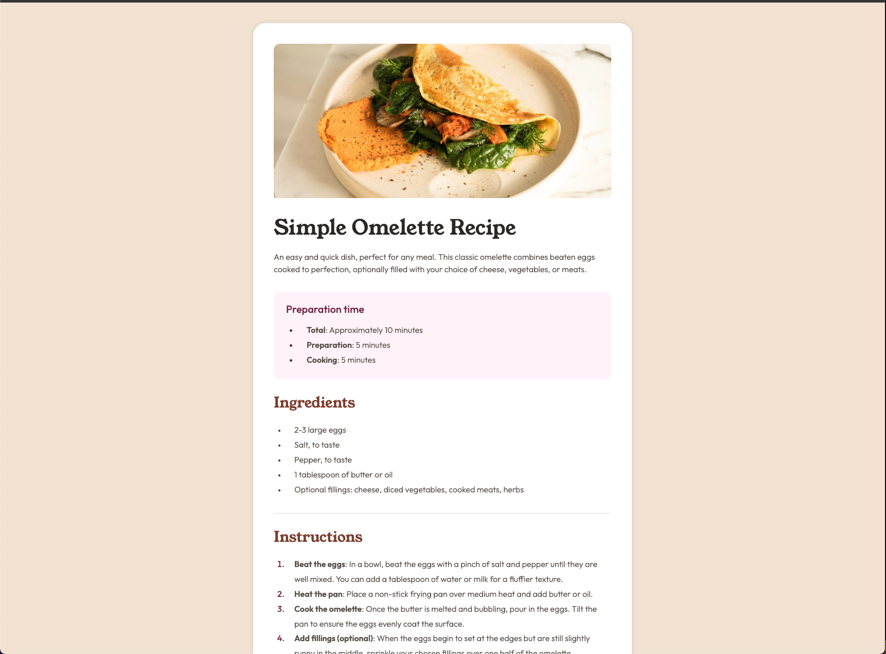

# Frontend Mentor - Recipe page solution

This is a solution to the [Recipe page challenge on Frontend Mentor](https://www.frontendmentor.io/challenges/recipe-page-KiTsR8QQKm). Frontend Mentor challenges help you improve your coding skills by building realistic projects.

## Table of contents

- [Overview](#overview)
  - [The challenge](#the-challenge)
  - [Screenshot](#screenshot)
  - [Links](#links)
- [My process](#my-process)
  - [Built with](#built-with)
  - [What I learned](#what-i-learned)
  - [Continued development](#continued-development)
  - [Useful resources](#useful-resources)
- [Author](#author)

## Overview

### Screenshot



### Links

- Solution URL: [Solution URL here](https://github.com/hectorlil48/recipe-page-main)
- Live Site URL: [Live site URL here](https://hectorlil48.github.io/recipe-page-main/)

## My process

### Built with

- Semantic HTML5 markup
- CSS custom properties
- Flexbox
- Media Queries

### What I learned

I learned a lot and feel confident in myself to start bigger projects. I was able to wrap all my HTML content with the right tags. I learned that you can target the bullets or numbers of a list by using :marker. This lets me change the li’s color and size when needed. I am also getting better at using media queries.

```html
<div class="prep-time">
  <h2>Preparation time</h2>
  <ul>
    <li><span class="bold">Total</span>: Approximately 10 minutes</li>
    <li><span class="bold">Preparation</span>: 5 minutes</li>
    <li><span class="bold">Cooking</span>: 5 minutes</li>
  </ul>
</div>
```

```css
li::marker {
  color: var(--rose-800);
}

@media (max-width: 780px) {
  .container {
    width: 616px;
  }
}

@media (max-width: 625px) {
  .container {
    width: 375px;
    border-radius: none;
    box-shadow: none;
    padding: 0;
  }
```

### Continued development

I got to see how media queries would work on a bigger page. I want to keep using them to understand them better. My CSS skills have improved but I want to make them better. I want to learn if it’s better to do mobile first styling. I think that would help me understand things more about media queries and might make my CSS look better.

### Useful resources

- [MDN](https://developer.mozilla.org/en-US/) - MDN helps me understand any tag of style that I want to use. I needed to target the li of a list and I got to find out about :marker. Which was useful to make the bullets and numbers a different color than the text.
- [Stackoverflow](https://stackoverflow.com/) - Stackoverflow is the first thing that comes up when I Google something. It is always so helpful to see what others have done.

## Author

- GitHub - [Hector Ramirez](https://github.com/hectorlil48)
- Frontend Mentor - [@hectorlil48](https://www.frontendmentor.io/profile/hectorlil48)
- LinkedIn - [@linkedin.com/in/hector-ramirez-6a6509170](https://www.linkedin.com/in/hector-ramirez-6a6509170/overlay/contact-info/)
